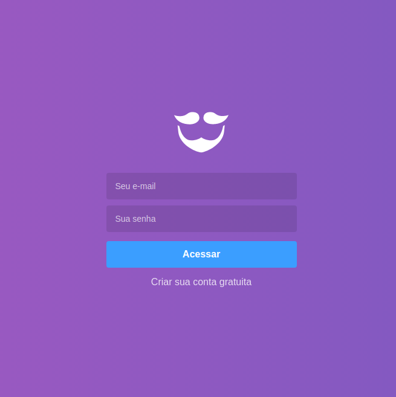
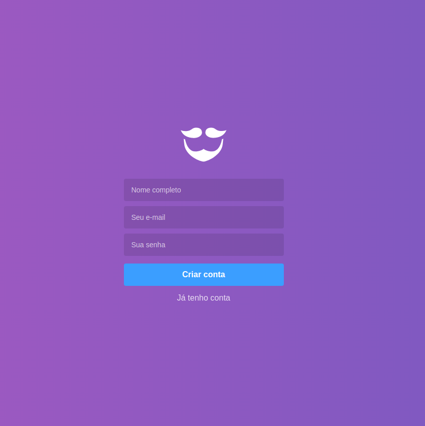
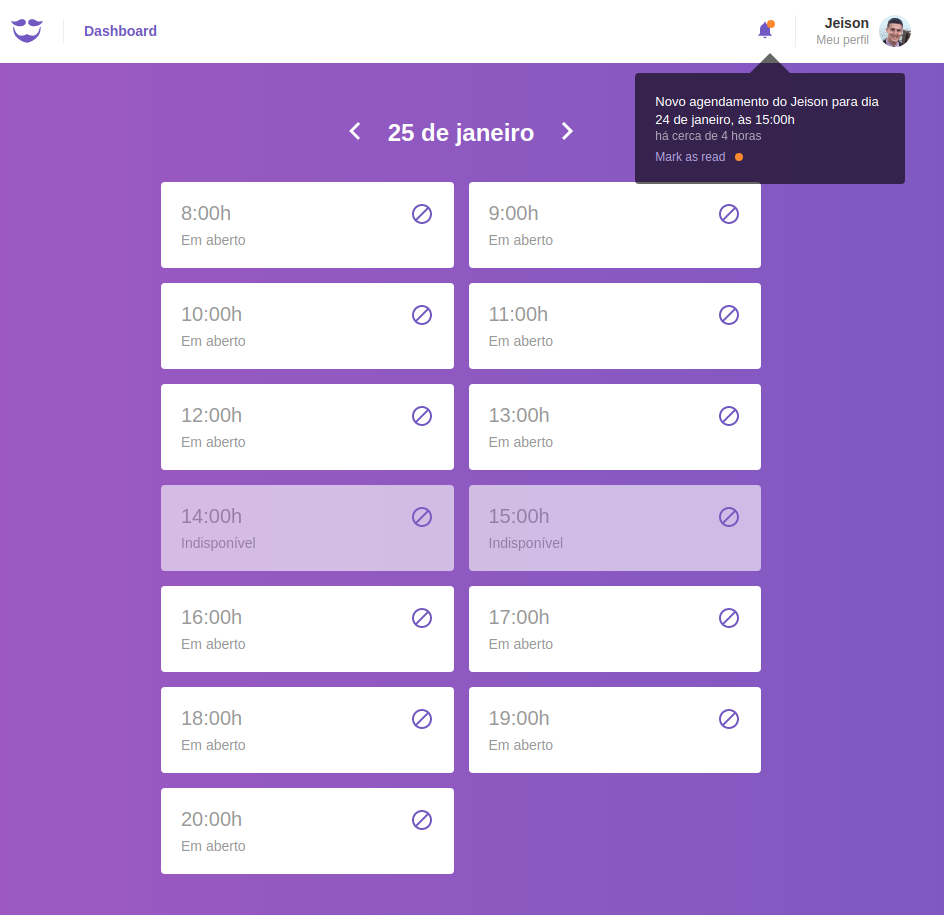
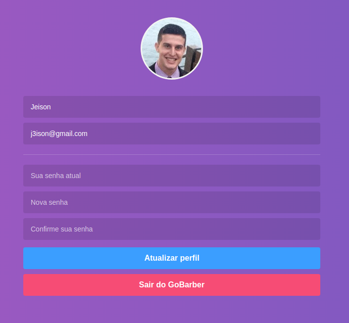

<h1 align="center">
    
    <br>
    GoBarber Web
</h1>

<h4 align="center">
  A barber scheduling app that shows to the barber his agenda for the day.
</h4>
<p align="center">
  
  
  
  
  <a href="https://www.codacy.com/manual/JeisonJHA/web-barber?utm_source=github.com&amp;utm_medium=referral&amp;utm_content=JeisonJHA/web-barber&amp;utm_campaign=Badge_Grade">
    
  </a>
  
  
  <a href="https://github.com/jeisonjha/web-barber/commits/master">
    
  </a>
  
  <a href="https://github.com/jeisonjha/web-barber/issues">
    
  </a>
  
     
</p>

<p align="center">
  <a href="#rocket-technologies">Technologies</a>&nbsp;&nbsp;&nbsp;|&nbsp;&nbsp;&nbsp;
  <a href="#information_source-how-to-use">How To Use</a>&nbsp;&nbsp;&nbsp;|&nbsp;&nbsp;&nbsp;
  <a href="#memo-license">License</a>
</p>

<p align="center">
     
     
     
     
</p>

## Improvements

Added a functionality to let a hour unavailable

## :rocket: Technologies

This project was developed at the [RocketSeat GoStack Bootcamp](https://rocketseat.com.br/bootcamp) with the following technologies:

- [ReactJS](https://reactjs.org/)
- [Create React App Configuration Override](https://github.com/sharegate/craco)
- [Redux](https://redux.js.org/)
- [Redux-Saga](https://redux-saga.js.org/)
- [React Router v4](https://github.com/ReactTraining/react-router)
- [styled-components](https://www.styled-components.com/)
- [Axios](https://github.com/axios/axios)
- [History](https://www.npmjs.com/package/history)
- [Immer](https://github.com/immerjs/immer)
- [Polished](https://polished.js.org/)
- [React-Toastify](https://fkhadra.github.io/react-toastify/)
- [React-Icons](http://react-icons.github.io/react-icons/)
- [react-perfect-scrollbar](https://github.com/OpusCapita/react-perfect-scrollbar)
- [Unform](https://github.com/Rocketseat/unform)
- [Yup](https://www.npmjs.com/package/yup)
- [date-fns](https://date-fns.org/)
- [Reactotron](https://infinite.red/reactotron)
- [VS Code][vc] with [EditorConfig][vceditconfig] and [ESLint][vceslint]

## :information_source: How To Use

To clone and run this application, you'll need [Git](https://git-scm.com), [Node.js v10.16][nodejs] or higher + [Yarn v1.13][yarn] or higher installed on your computer and the [Back Barber](https://github.com/jeisonjha/back-barber). From your command line:

```bash
# Clone this repository
$ git clone https://github.com/jeisonjha/web-barber

# Go into the repository
$ cd web-barber

# Install dependencies
$ yarn install

# Run the app
$ yarn start
```

## :memo: License

This project is under the MIT license. See the [LICENSE](https://github.com/jeisonjha/web-barber/blob/master/LICENSE) for more information.

---

Made by Jeison Azevedo :wave: [Get in touch!](https://www.linkedin.com/in/jeison-azevedo/)

[nodejs]: https://nodejs.org/
[yarn]: https://yarnpkg.com/
[vc]: https://code.visualstudio.com/
[vceditconfig]: https://marketplace.visualstudio.com/items?itemName=EditorConfig.EditorConfig
[vceslint]: https://marketplace.visualstudio.com/items?itemName=dbaeumer.vscode-eslint
